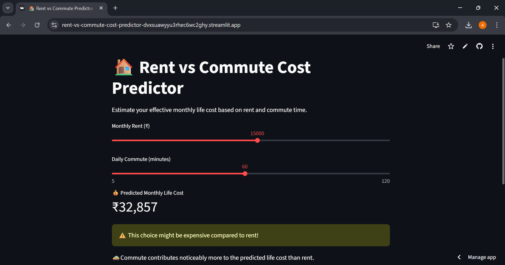
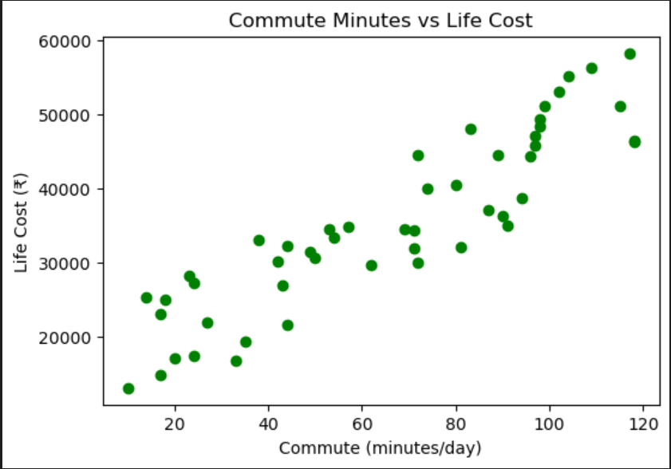
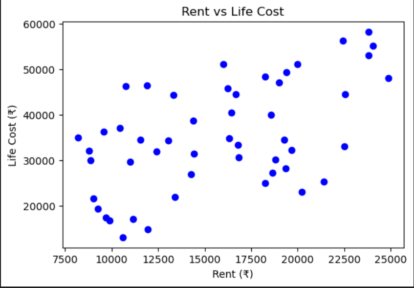
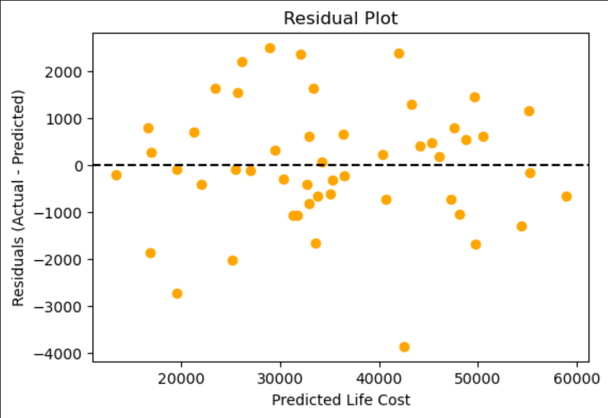
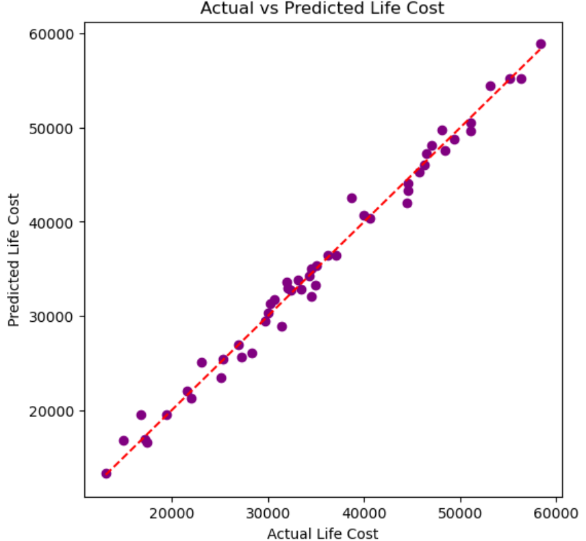

🏙️ Rent vs Commute: Life Cost Predictor

An Interpretable Machine Learning Web App

A complete end-to-end Machine Learning + Streamlit project that predicts a person’s monthly life cost based on rent and daily commute time, while clearly explaining which factor drives the cost more.

This project focuses not only on prediction accuracy, but also on interpretability and decision-making, making it suitable for real-world use.

---

🚀 Live Application

🔗 Deployed App: [(Streamlit deployment link)](https://rent-vs-commute-cost-predictor-dvxsuawyyu3rhec6wc2ghy.streamlit.app/)

---

🎯 Motivation

When choosing where to live, people often face a trade-off:
Higher rent with shorter commute, or
Lower rent with longer commute?

This project answers a practical question:
> Which factor contributes more to overall life cost — rent or commute time?

Instead of treating the model as a black box, this app explains why a particular prediction was made.

---

🧠 Methodology

The project uses Linear Regression, trained using Gradient Descent, to model life cost as a linear combination of rent and commute time.

Model Equation
Life Cost = Intercept + (Rent Coefficient × Rent) + (Commute Coefficient × Commute Time)
Each term is explicitly shown in the app to improve transparency and trust.

---

📊 Dataset

A small, carefully constructed dataset with realistic ranges, with the following features:

Rent:	Monthly rent (₹)

Commute Time:	Daily commute duration (minutes)

Life Cost:	Estimated monthly cost of living (₹)

The dataset includes controlled noise to reflect real-world variability and avoid overfitting.

---

🧪 Model Evaluation

Training Method: Gradient Descent

Evaluation Technique: Residual analysis

Observation: Residuals are randomly scattered around zero

This indicates:

-No systematic bias

-Linear model is appropriate

-Remaining error is largely due to noise

---

🖥️ Application Features

User Inputs

-Monthly Rent (₹)

-Daily Commute Time (minutes)

Outputs

-Predicted Monthly Life Cost

-Rent contribution to cost

-Commute contribution to cost

Baseline (intercept)

-Interpretability Layer

The app explains:

-Which factor contributes more to life cost

-When both factors contribute within a similar range

-What adjustment would most effectively reduce cost

This turns the application from a simple predictor into a decision-support tool.

---

🛠️ Technology Stack

-Python

-NumPy

-Pandas

-Matplotlib

-Streamlit

-Git & GitHub

---
▶️ Running the App Locally

git clone https://github.com/anantaeeti/rent-vs-commute-cost-predictor.git

cd rent-vs-commute-cost-predictor

pip install -r requirements.txt

streamlit run app.py

---

🌐 Deployment

The application is deployed using Streamlit Community Cloud.
Any updates pushed to the main branch automatically trigger a redeployment.

---

📈 Key Learnings

-Translating ML theory into a usable product

-Understanding and explaining regression coefficients

-Interpreting residual plots correctly

-Designing ML systems with interpretability in mind

-Deploying interactive ML applications

---

🔮 Future Enhancements

-Add additional cost drivers (utilities, city index, lifestyle)

-Compare Linear vs Polynomial Regression

-Add confidence intervals to predictions

-Improve UI with advanced Streamlit components

---

📝 Conclusion

This project demonstrates a strong foundation in:

-Core machine learning concepts

-Model interpretability

-Practical problem solving

-End-to-end ML deployment

It emphasizes that a good ML model is not just accurate, but explainable.

